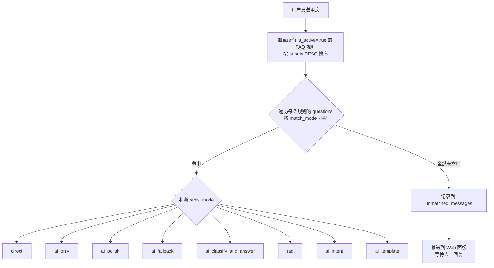
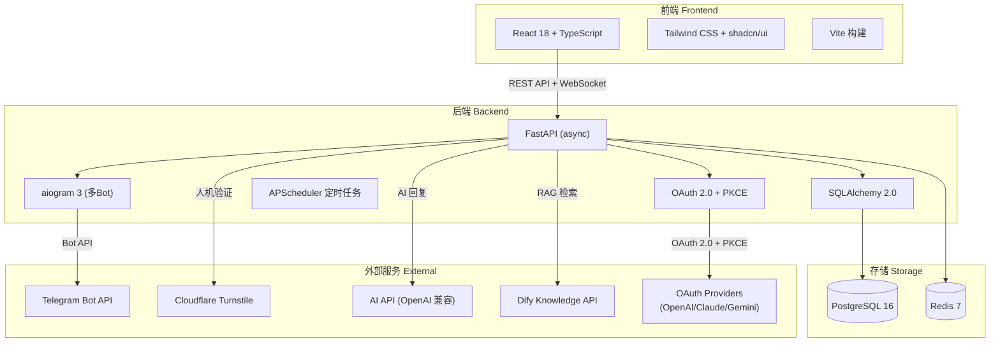
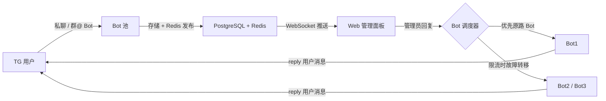
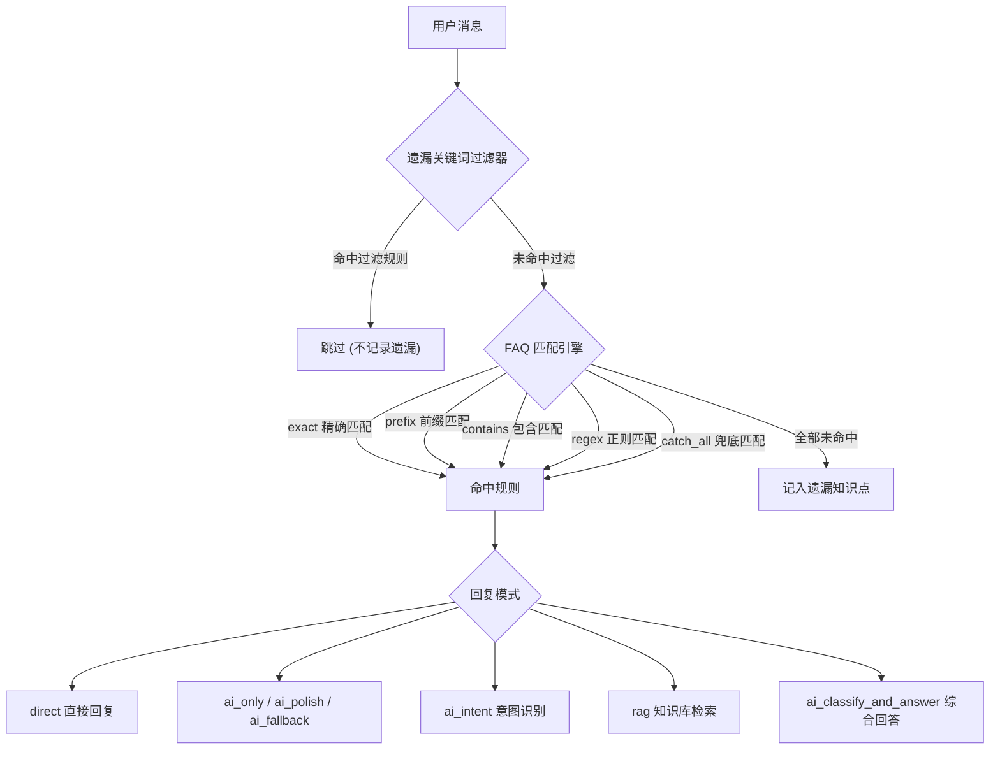
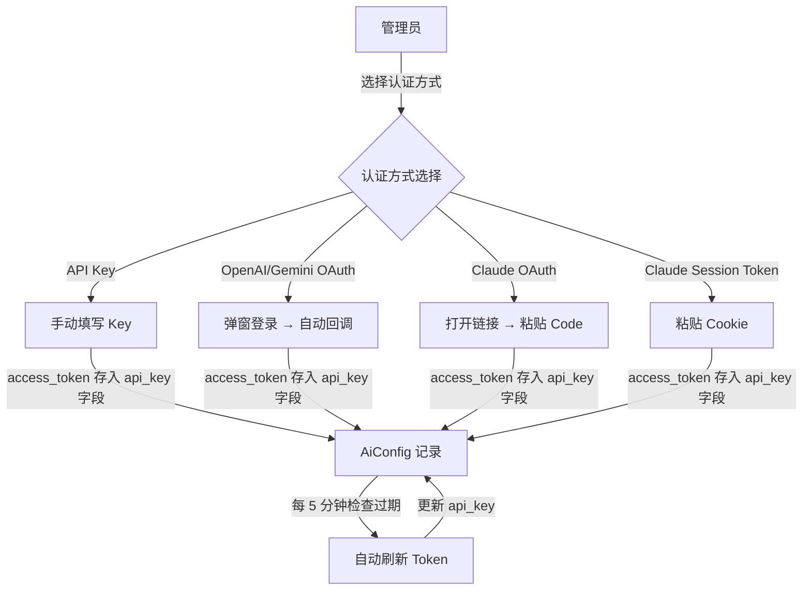

[English](./README_EN.md) | 中文

---

<!-- Community & Status -->


<!-- Tech Stack -->


<!-- Fun / Vibe -->


# ADMINCHAT Panel

> &reg; 2026 NovaHelix & SAKAKIBARA. All rights reserved.

**Telegram 双向消息转发 Bot + Web 客服管理面板** &mdash; 一站式 Telegram 客户服务解决方案，支持多 Bot 池管理、FAQ 自动回复引擎（5 种匹配模式 + 8 种回复模式）、RAG 知识库检索、AI Provider OAuth 多认证、遗漏关键词过滤器和实时 Web 聊天。

---

## 项目简介

ADMINCHAT Panel 是一个功能完备的 Telegram 客服管理系统。它将 Telegram Bot 收到的私聊消息和群组 @提及 消息统一转发到 Web 管理面板，让管理员/客服人员可以在浏览器中实时查看并回复用户消息，同时支持 FAQ 自动回复、AI 智能应答、RAG 知识库检索、用户管理等丰富功能。

## 核心功能

### 消息转发与通信
- **多 Bot 池管理** &mdash; 支持无限添加 Bot，自动限流检测（Redis 令牌桶算法）与故障转移
- **双向消息转发** &mdash; 私聊 + 群组 @Bot，文本/图片/视频/文件/Markdown 格式完整保留
- **Web 实时聊天** &mdash; 基于 WebSocket 的实时消息推送，类似客服系统的聊天界面
- **Bot 分组 + FAQ 分组路由** &mdash; Bot 按组管理，FAQ 规则按 组-分类 两级归类，匹配后自动选择对应组的 Bot 回复

### FAQ 自动回复引擎
- **5 种匹配模式** &mdash; 精确匹配 / 前缀匹配 / 包含匹配 / 正则匹配 / Catch All 兜底匹配
- **8 种回复模式** &mdash; 直接回复 / 纯 AI / AI 润色 / AI 兜底 / AI 意图识别 / 模板填充 / RAG 知识库 / AI 综合回答
- **遗漏关键词过滤器** &mdash; 可配置过滤规则（4 种匹配模式），自动跳过 Bot 命令等无效关键词，保持遗漏知识点统计的准确性
- **遗漏知识点分析** &mdash; 自动统计未匹配问题，每日凌晨 3 点更新排行榜

<details>
<summary><strong>FAQ 匹配与回复模式详细流程（点击展开）</strong></summary>

#### 整体匹配流程



#### 5 种匹配模式说明

| 模式 | 关键词示例 | 用户输入 "你好，请问价格多少？" | 适用场景 |
|------|-----------|-------------------------------|---------|
| `exact` | `请问价格多少` | 不匹配（必须完全相同） | 精确控制，如特定指令 |
| `prefix` | `你好` | 匹配（从头开始） | 问候语、固定开头 |
| `contains` | `价格` | 匹配（包含即可） | 最常用，关键词触发 |
| `regex` | `价格\|多少钱\|费用` | 匹配（正则匹配） | 多关键词/复杂模式 |
| `catch_all` | `*`（自动填充） | 匹配（匹配所有消息） | 兜底规则，搭配 RAG/AI |

> **优先级**：`priority` 值越大越先匹配。建议 `catch_all` 设为最低优先级（如 1），确保精确规则优先。

#### 8 种回复模式流程

**1. `direct` — 直接回复**
```
用户消息 → FAQ 匹配 → 直接返回预设答案（不调 AI）
```
最简单的模式，适合固定回答（如营业时间、联系方式）。

**2. `ai_only` — 纯 AI 回复**
```
用户消息 → FAQ 匹配 → 发送用户问题给 AI → AI 生成回答 → 回复用户
```
FAQ 规则仅作触发器，回答完全由 AI 生成。适合开放性问题。

**3. `ai_polish` — AI 润色**
```
用户消息 → FAQ 匹配 → 取出预设答案 → AI 润色改写 → 回复用户
```
预设答案 + AI 改写为更自然的语言。保留核心信息的同时让回复更人性化。

**4. `ai_fallback` — AI 兜底**
```
用户消息 → FAQ 匹配 → 有预设答案？
                        ├── 是 → 直接返回预设答案
                        └── 否 → AI 生成回答
```
优先使用 FAQ 预设答案，没有时才调 AI。节省 AI 调用成本。

**5. `ai_classify_and_answer` — AI 综合回答**
```
用户消息 → FAQ 匹配 → 预设答案作为知识上下文 → AI 综合理解后生成回答 → 回复用户
```
AI 参考 FAQ 知识库内容，综合理解后生成更完整的回答。

**6. `rag` — RAG 知识库检索**
```
用户消息 → FAQ 匹配 → Dify Knowledge API 向量搜索
          → 返回相关文档片段 → AI 基于检索结果生成回答 → 回复用户
```
最强大的模式。从外部知识库检索相关信息，AI 基于检索结果回答。适合大量文档/产品信息场景。

**7. `ai_intent` — AI 意图识别**
```
用户消息 → FAQ 匹配 → AI 分析用户意图 → 返回分类结果（JSON）
```
AI 将用户问题分类到预定义的类别中，返回 `{"category": "xxx", "confidence": 0.95}` 格式。

**8. `ai_template` — 模板填充**
```
用户消息 → FAQ 匹配 → 取出模板（含 {变量} 占位符）→ AI 根据用户问题填充变量 → 回复用户
```
预定义回答模板，AI 智能填充变量。适合格式化回答场景。

#### 推荐配置组合

| 场景 | 匹配模式 | 回复模式 | 说明 |
|------|---------|---------|------|
| 固定 FAQ | `contains` / `regex` | `direct` | 营业时间、联系方式等 |
| 产品咨询 | `regex` | `ai_polish` | AI 润色预设答案，更自然 |
| 知识库问答 | `catch_all` (低优先级) | `rag` | 兜底走知识库检索 |
| 通用客服 | `catch_all` (最低优先级) | `ai_only` | 所有未匹配消息交给 AI |
| 混合模式 | 高优先级 `contains` + 低优先级 `catch_all` | `direct` + `rag` | 精确匹配优先，未匹配走 RAG |

</details>

### AI 与知识库
- **RAG 知识库检索** &mdash; 模块化 RAG 架构，已对接 Dify Knowledge API（支持 GTE-multilingual + pgvector），模块化 `rag_configs` 配置，可扩展其他 RAG 平台
- **AI Provider OAuth 多认证** &mdash; 支持 API Key / OpenAI OAuth / Claude OAuth / Claude Session Token / Gemini OAuth 五种认证方式，自动 Token 刷新
- **AI 集成** &mdash; 兼容 OpenAI API 格式，支持多 AI 服务商配置

<details>
<summary><strong>RAG 知识库推荐配置指南（点击展开）</strong></summary>

#### 完整 RAG 客服流程

```
用户在 Telegram 发消息
  → ADMINCHAT Bot 收到消息
  → FAQ Engine 匹配规则（reply_mode=rag）
  → 调 Dify Knowledge API（把用户问题发过去）
  → Dify 用 GTE-multilingual-base 把问题转成向量
  → pgvector 向量搜索，找到最相关的知识库内容
  → 返回搜索结果给 ADMINCHAT
  → ADMINCHAT 调 AI API（搜索结果 + 用户问题）
  → AI 根据知识库内容生成自然语言回答
  → Bot 回复用户
```

各组件职责：

| 组件 | 职责 |
|------|------|
| **Dify** | 知识库管理 + 向量搜索（只搜不答） |
| **GTE-multilingual-base** | Embedding 模型（文字→向量，可跑在 CPU 上） |
| **pgvector**（PostgreSQL 扩展） | 存储和检索向量 |
| **AI API**（外部，如 GPT/Claude） | 生成最终回答（基于知识库内容润色） |
| **ADMINCHAT Panel** | 串联所有组件 + Telegram Bot 管理 |

#### 第 1 步：部署 Dify

推荐使用 Dify 官方 Docker Compose 部署。

```bash
# 克隆 Dify
git clone https://github.com/langgenius/dify.git
cd dify/docker

# 复制环境变量
cp .env.example .env

# 启动（包含 PostgreSQL + pgvector + Redis + Dify API + Web）
docker compose up -d
```

启动后访问 `http://your-server-ip` 完成 Dify 初始化设置。

> **进阶**：如果你已有 PostgreSQL（带 pgvector 扩展）和 Redis，可以通过 `docker-compose.override.yaml` 禁用 Dify 自带的数据库组件，让 Dify 连接你现有的服务。参考 Dify 官方文档的外部数据库配置说明。

#### 第 2 步：部署 Text Embedding Inference (TEI)

GTE-multilingual-base 是推荐的多语言 Embedding 模型，约 1.1GB，可以在 CPU 上运行。通过 Hugging Face TEI 容器部署。

**方法 A：自动下载模型（简单，但首次启动慢）**

```bash
docker run -d \
  --name gte-embedding \
  --restart unless-stopped \
  -p 8090:80 \
  -v tei-data:/data \
  ghcr.io/huggingface/text-embeddings-inference:cpu-1.6 \
  --model-id Alibaba-NLP/gte-multilingual-base \
  --port 80
```

> 首次启动会自动从 Hugging Face 下载模型，可能需要几分钟。

**方法 B：预下载模型到本地（推荐，启动更快）**

```bash
# 先下载模型到本地目录
mkdir -p /opt/models
pip install huggingface_hub
huggingface-cli download Alibaba-NLP/gte-multilingual-base \
  --local-dir /opt/models/gte-multilingual-base

# 启动 TEI 容器，挂载本地模型目录
docker run -d \
  --name gte-embedding \
  --restart unless-stopped \
  -p 8090:80 \
  -v /opt/models/gte-multilingual-base:/model \
  ghcr.io/huggingface/text-embeddings-inference:cpu-1.6 \
  --model-id /model \
  --port 80
```

**验证 TEI 是否正常运行：**

```bash
curl http://localhost:8090/embed \
  -X POST \
  -H 'Content-Type: application/json' \
  -d '{"inputs": "测试文本"}'
```

**将 TEI 加入 Docker 网络（与 Dify 互通）：**

```bash
# 如果 Dify 使用默认网络 docker_default
docker network connect docker_default gte-embedding

# 或者如果你用了自定义网络
docker network connect your-shared-network gte-embedding
```

#### 第 3 步：在 Dify 中安装 TEI 插件并配置

1. 登录 Dify 管理后台 → **插件 (Plugins)**
2. 搜索 `Text Embedding Inference` → 安装
3. 进入 **设置** → **模型供应商** → 找到 **Text Embedding Inference**
4. 配置：
   - **模型名称**: `gte-multilingual-base`（标识用，可自定义）
   - **服务器 URL**: `http://gte-embedding:80`（Docker 内部网络名称）
5. 保存并测试连接

> **注意**：TEI 容器名称就是 Docker 内部 DNS 名称。只要两者在同一个 Docker 网络内，就可以用容器名直接访问。

#### 第 4 步：创建知识库并导入文档

1. 进入 Dify → **知识库** → **创建知识库**
2. 选择 Embedding 模型为 `gte-multilingual-base`
3. 上传文档（支持 TXT、PDF、Markdown、CSV 等）
4. Dify 会自动分段、向量化并存入 pgvector
5. 创建完成后，记录：
   - **Dataset ID**：知识库 URL 中的 UUID（如 `datasets/abc123-def456/...` 中的 `abc123-def456`）

#### 第 5 步：获取 Dify API 凭证

1. 进入 Dify → **知识库** → 选择你的知识库
2. 进入 **API 访问** 或 **设置**
3. 获取 **Dataset API Key**（格式为 `dataset-xxxxxxxx`）
4. 记录 Dify API 内部地址：`http://<dify-api容器名>:5001/v1`（Docker 内部）

> Dify API 容器默认监听 5001 端口。容器名可通过 `docker ps | grep dify-api` 查看（通常为 `docker-api-1`）。

#### 第 6 步：在 ADMINCHAT Panel 中配置 RAG

1. 登录 ADMINCHAT 管理面板
2. 进入 **AI Settings** → **RAG Knowledge Base** 标签页
3. 点击 **Add RAG Config**，填写：
   - **Name**: 自定义名称（如 "产品知识库"）
   - **Provider**: `dify`
   - **Base URL**: Dify API 内部地址（如 `http://docker-api-1:5001/v1`）
   - **API Key**: Dataset API Key（`dataset-xxxxxxxx`）
   - **Dataset ID**: 知识库 UUID
   - **Top K**: `3`（返回前 3 条最相关结果）
4. 点击 **Test** 验证连接
5. 保存

> **重要**：ADMINCHAT 后端容器必须与 Dify API 容器在同一个 Docker 网络内，否则无法通过容器名访问。

#### 第 7 步：配置 FAQ 规则使用 RAG

1. 进入 **FAQ Rules** → 创建或编辑规则
2. 设置 **Reply Mode** 为 `rag`
3. 选择刚创建的 **RAG Config**
4. 推荐搭配 `catch_all` 匹配模式作为兜底规则（低 priority），让所有未被其他规则命中的消息走 RAG

#### 推荐部署架构

```
┌───────────────────────────────────────────────────────┐
│  Docker Host                                           │
│                                                         │
│  ┌── 共享 Docker Network ──────────────────────────┐   │
│  │                                                   │   │
│  │  ┌──────────────┐   ┌────────────────────────┐   │   │
│  │  │ ADMINCHAT    │   │ Dify                    │   │   │
│  │  │  backend     │──→│  api (:5001)            │   │   │
│  │  │  frontend    │   │  web                    │   │   │
│  │  └──────────────┘   │  worker                 │   │   │
│  │                      │  plugin_daemon          │   │   │
│  │  ┌──────────────┐   └────────────────────────┘   │   │
│  │  │ TEI Server   │                                 │   │
│  │  │ gte-multi    │   ┌────────────────────────┐   │   │
│  │  │ (:80/8090)   │   │ PostgreSQL + pgvector   │   │   │
│  │  └──────────────┘   │ Redis                   │   │   │
│  │                      └────────────────────────┘   │   │
│  └───────────────────────────────────────────────────┘   │
│                                                           │
│                ┌─────────────────────┐                    │
│                │ AI API (外部)       │                    │
│                │ GPT / Claude / etc. │                    │
│                └─────────────────────┘                    │
└───────────────────────────────────────────────────────┘
```

> **提示**：所有组件（ADMINCHAT、Dify、TEI、PostgreSQL、Redis）通过同一个 Docker bridge 网络互通，使用容器名作为 DNS 地址通信。这样无需暴露额外端口，更快更安全。

</details>

### 插件系统 (Plugin System)
- **ACP 插件架构** &mdash; 沙箱化插件运行时，支持数据库/Bot Handler/API 路由/前端页面/设置面板五种能力声明，插件内部模块自动路径隔离
- **ACP Market 集成** &mdash; 通过 [ACP Market](https://acpmarket.novahelix.org) 浏览、安装和管理第三方插件，安装成功/失败有即时通知提示，未连接 Market 时自动显示引导提示
- **Market JWT 认证** &mdash; 支持邮箱密码登录或 API Key 粘贴连接 Market，Bearer Token 自动管理，Settings 页面显示 Market 账户状态
- **Ed25519 插件签名验证** &mdash; 自动从 Market 获取公钥，下载插件时验证 Ed25519 签名，防止插件包被篡改
- **卸载确认与数据清理** &mdash; 卸载插件前弹出确认对话框，可选"删除所有插件数据（数据库表）"
- **插件设置快捷入口** &mdash; 已安装插件列表中带有设置面板的插件显示齿轮图标，点击直接跳转到对应设置标签页
- **插件数据持久化** &mdash; 插件文件存储在独立的 `/data/plugins` 卷中，容器重启后不会丢失；加载失败时自动显示错误信息和重试按钮
- **共享依赖架构** &mdash; Panel 通过 `window` 全局变量向插件提供 React / ReactDOM / TanStack Query 等共享依赖，插件以 IIFE 格式构建，避免双 React 实例和模块解析问题
- **Plugin SDK + CLI** &mdash; [acp-plugin-sdk](https://github.com/fxxkrlab/acp-plugin-sdk) 提供类型提示 + `acp-cli` 命令行工具，支持 init / validate / build / publish 全流程
- **官方插件仓库** &mdash; [ACP_PLUGINS](https://github.com/fxxkrlab/ACP_PLUGINS) 开源示例插件（如 TMDB 求片系统）

### 用户与安全
- **用户管理** &mdash; 标签/分组/拉黑/搜索，完整的 TG 用户信息展示
- **Cloudflare Turnstile** &mdash; 私聊用户人机验证，防止滥用
- **角色权限系统** &mdash; Super Admin / Admin / Agent 三级权限，细粒度权限控制
- **操作审计日志** &mdash; 关键操作自动记录，可追溯

### 部署与运维
- **Docker 一键部署** &mdash; `docker compose up` 即可运行，支持 GHCR 镜像发布
- **全局 Error Boundary** &mdash; 前端运行时错误优雅降级，不影响整体系统可用性

## 界面预览

<p align="center">
  
  
</p>
<p align="center">
  
  
</p>
<p align="center">
  
  
</p>
<p align="center">
  
</p>

<details>
<summary><strong>技术架构（点击展开）</strong></summary>



#### 消息路由流程



#### FAQ 匹配与回复流程



#### AI Provider OAuth 认证流程



</details>

<details>
<summary><strong>数据库结构与功能参考表（点击展开）</strong></summary>

### 数据库结构

| 表名 | 说明 | 核心字段 |
|------|------|---------|
| `admins` | 管理员/客服 | username, role, permissions (JSONB) |
| `tg_users` | Telegram 用户 | tg_uid, is_blocked, turnstile_verified_at |
| `bots` | Bot 池 | token, priority, is_rate_limited |
| `conversations` | 会话 | status, source_type, assigned_to |
| `messages` | 消息记录 | direction, content_type, faq_matched |
| `tg_groups` | Telegram 群组 | tg_chat_id, title |
| `tags` / `user_tags` | 用户标签 | name, color (多对多) |
| `user_groups` | 用户分组 | name, description |
| `faq_questions` | FAQ 问题/关键词 | keyword, match_mode |
| `faq_answers` | FAQ 答案 | content, content_type |
| `faq_rules` | FAQ 规则 | response_mode, reply_mode, category_id |
| `faq_groups` | FAQ 分组 (一级) | name, bot_group_id |
| `faq_categories` | FAQ 分类 (二级) | name, faq_group_id, bot_group_id |
| `faq_hit_stats` | FAQ 命中统计 | hit_count, date |
| `missed_keywords` | 遗漏知识点 | keyword, occurrence_count |
| `missed_keyword_filters` | 遗漏关键词过滤器 | pattern, match_mode (exact/prefix/contains/regex) |
| `bot_groups` | Bot 分组 | name, description |
| `bot_group_members` | Bot 分组成员 | bot_group_id, bot_id (唯一) |
| `ai_configs` | AI 配置 | base_url, api_key, model, auth_method, oauth_data |
| `ai_usage_logs` | AI 用量日志 | tokens_used, cost_estimate |
| `rag_configs` | RAG 知识库配置 | provider, base_url, api_key, dataset_id, top_k, is_active |
| `installed_plugins` | 已安装插件 | plugin_id, version, status, config |
| `plugin_secrets` | 插件密钥存储 | plugin_id, key, encrypted_value |
| `system_settings` | 系统设置 | key-value (JSONB) |
| `audit_logs` | 审计日志 | action, target_type, details |

> 共 34 张表，完整设计参见 [docs/DATABASE_DESIGN.md](docs/DATABASE_DESIGN.md)

## FAQ 匹配模式

| 匹配模式 | 代码标识 | 说明 |
|---------|---------|------|
| 精确匹配 | `exact` | 用户消息与关键词完全一致时命中 |
| 前缀匹配 | `prefix` | 用户消息以关键词开头时命中 |
| 包含匹配 | `contains` | 用户消息包含关键词时命中 |
| 正则匹配 | `regex` | 用户消息满足正则表达式时命中 |
| 兜底匹配 | `catch_all` | 匹配任何消息，用于 RAG 知识库兜底规则（最低优先级） |

## FAQ 回复模式

| 模式 | 代码标识 | 说明 |
|------|---------|------|
| 纯正则匹配 | `direct` | 关键词匹配后直接返回预设答案 |
| 纯 AI 回复 | `ai_only` | 用户问题直接交给 AI（有次数限制） |
| AI 润色 | `ai_polish` | 匹配预设答案后让 AI 改写更自然 |
| AI 兜底 | `ai_fallback` | 先走 FAQ，未命中再交 AI |
| AI 意图识别 | `ai_intent` | AI 分析意图后路由到对应 FAQ 分类 |
| 模板填充 | `ai_template` | 预设模板 + AI 动态填充变量 |
| RAG 知识库 | `rag` | 向量检索 (Dify/pgvector) + AI 综合回答 |
| AI 综合回答 | `ai_classify_and_answer` | AI 参考 FAQ 知识库综合生成回答 |

## 遗漏关键词过滤器

遗漏关键词过滤器位于「遗漏知识点」页面（`/faq/missed`），用于过滤不需要记录为遗漏知识点的消息（如 Bot 命令 `/start`、`/help` 等）。

| 过滤模式 | 说明 | 示例 |
|---------|------|------|
| `exact` | 精确匹配 | 过滤 `/start` 仅匹配完全等于 `/start` 的消息 |
| `prefix` | 前缀匹配 | 过滤 `/` 匹配所有以 `/` 开头的 Bot 命令 |
| `contains` | 包含匹配 | 过滤 `bot` 匹配所有包含 `bot` 的消息 |
| `regex` | 正则匹配 | 过滤 `^/\w+` 匹配所有斜杠命令格式的消息 |

## AI Provider 认证方式

| 方式 | 流程 | 说明 |
|------|------|------|
| API Key | 手动填写 | 传统方式，直接输入 Base URL + API Key |
| OpenAI OAuth | 弹窗登录 | OAuth 2.0 + PKCE，浏览器弹窗认证后自动回调 |
| Claude OAuth | 粘贴 Code | OAuth 2.0 + PKCE，Claude 固定回调页面显示 code，手动粘贴 |
| Claude Session Token | 粘贴 Cookie | 从 claude.ai 复制 sessionKey cookie，后端自动换取 token |
| Gemini OAuth | 弹窗登录 | Google OAuth 2.0 + PKCE，浏览器弹窗认证后自动回调 |

> Token 自动刷新：后台每 5 分钟检查即将过期的 OAuth token 并自动续期，服务启动时也会补偿刷新。

</details>

## 快速开始

```bash
# 克隆仓库
git clone https://github.com/fxxkrlab/ADMINCHAT_PANEL.git
cd ADMINCHAT_PANEL/deploy

# 配置环境变量
cp .env.example .env
nano .env  # 修改密码、Bot Token、域名等

# 一键启动 (包含 PostgreSQL + Redis + Nginx)
docker compose -f docker-compose.full.yml up -d

# 访问 http://服务器IP
# 默认账号: admin / 密码见 .env 中的 INIT_ADMIN_PASSWORD
```

## 安装方式

详细部署文档见 [`deploy/README.md`](deploy/README.md)

| 方式 | 文件 | 适用场景 |
|------|------|---------|
| Docker Run | [`deploy/docker-run.sh`](deploy/docker-run.sh) | 已有 PG+Redis，只部署应用 |
| Compose 独立版 | [`deploy/docker-compose.standalone.yml`](deploy/docker-compose.standalone.yml) | 已有 PG+Redis，Compose 管理 |
| Compose 一键版 | [`deploy/docker-compose.full.yml`](deploy/docker-compose.full.yml) | 全新服务器，一键全部 |

每种方式都支持 **Named Volume**（Docker 管理）和 **Bind Mount**（映射宿主机目录），在 yml 文件注释中切换。

<details>
<summary><strong>项目结构（点击展开）</strong></summary>

```
ADMINCHAT_PANEL/
├── backend/                    # Python 后端
│   ├── app/
│   │   ├── api/v1/            # REST API 路由 (18 个模块)
│   │   ├── bot/               # Telegram Bot 核心
│   │   │   ├── manager.py     # 多 Bot 生命周期管理
│   │   │   ├── handlers/      # 消息处理器 (私聊/群组/指令)
│   │   │   ├── dispatcher.py  # 消息发送 + 故障转移
│   │   │   └── rate_limiter.py# 限流检测 (Redis 令牌桶)
│   │   ├── faq/               # FAQ 引擎
│   │   │   ├── engine.py      # 匹配引擎 (5 种匹配模式)
│   │   │   ├── ai_handler.py  # AI 回复处理 (8 种回复模式)
│   │   │   ├── rag_handler.py # RAG 兼容 wrapper
│   │   │   └── rag/           # 模块化 RAG 系统
│   │   │       ├── base.py    # RAGProvider 抽象基类
│   │   │       └── dify_provider.py  # Dify Knowledge API
│   │   ├── oauth/             # OAuth 2.0 多认证
│   │   │   ├── base.py        # OAuthProvider 抽象基类
│   │   │   ├── encryption.py  # Fernet Token 加密
│   │   │   ├── openai.py      # OpenAI OAuth + PKCE
│   │   │   ├── claude.py      # Claude OAuth + Session Token
│   │   │   ├── gemini.py      # Gemini/Google OAuth + PKCE
│   │   │   └── token_refresh.py # 自动 Token 刷新任务
│   │   ├── models/            # SQLAlchemy ORM (30 张表)
│   │   ├── schemas/           # Pydantic 请求/响应模型
│   │   ├── services/          # 业务服务 (Redis/审计/媒体/Turnstile)
│   │   ├── ws/                # WebSocket 实时通信
│   │   └── tasks/             # 定时任务 (APScheduler)
│   ├── alembic/               # 数据库迁移
│   └── Dockerfile
├── frontend/                   # React 前端
│   ├── src/
│   │   ├── pages/             # 16 个页面
│   │   ├── components/        # 可复用组件 (chat/layout/ui/ai)
│   │   │   ├── ai/           # OAuth 认证组件
│   │   │   │   ├── AuthMethodSelector.tsx  # 认证方式选择器
│   │   │   │   └── OAuthFlowModal.tsx      # OAuth 流程弹窗
│   │   │   └── ErrorBoundary.tsx  # 全局错误边界
│   │   ├── stores/            # Zustand 状态管理
│   │   ├── services/          # API 调用层 (11 个模块)
│   │   ├── hooks/             # 自定义 hooks (WebSocket/debounce)
│   │   └── types/             # TypeScript 类型定义
│   └── Dockerfile
├── deploy/                     # 部署配置
├── docs/                       # 设计文档
├── docker-compose.yml          # 本地开发 (仅 PG+Redis)
├── .env.example
└── LICENSE                     # GPL-3.0
```

</details>

<details>
<summary><strong>开发指南（点击展开）</strong></summary>

### 后端开发

```bash
cd backend
python -m venv .venv
source .venv/bin/activate
pip install -r requirements.txt

# 需要 PostgreSQL 和 Redis 运行中
# 可以用 docker compose up postgres redis -d 启动

# 运行数据库迁移
alembic upgrade head

# 启动开发服务器
uvicorn app.main:app --reload --port 8000
```

### 前端开发

```bash
cd frontend
npm install
npm run dev
# 访问 http://localhost:5173
```

### 代码规范

- 后端全部使用异步（`async def` / `await`），SQLAlchemy 2.0 风格 + async session
- 前端使用函数式组件 + Hooks，Zustand 管理全局状态，TanStack Query 管理服务端状态
- 数据库查询注意使用 `joinedload` / `selectinload` 避免 N+1 问题
- Pydantic Schema 使用 `default_factory` 处理可变默认值（如 `list`、`dict`）

</details>

## 版本说明

- **公开版本**: `VERSION` 文件 (semver 格式)
- **内部版本**: `BUILD_VERSION` 文件 (格式 YYYYMMDD.NNNN)
- 页脚显示: `Powered By ADMINCHAT PANEL v{VERSION} ({BUILD_VERSION})`

## 许可证

本项目采用 [GNU General Public License v3.0](LICENSE) 开源。

**版权所有 &copy; 2026 NovaHelix & SAKAKIBARA**

你可以自由使用、修改和分发本软件，但必须：
- 保持开源（不可闭源商用，版权所有者除外）
- 保留原始版权声明
- 使用相同的 GPL-3.0 许可证

---

<p align="center">
  <small>&reg; 2026 NovaHelix & SAKAKIBARA</small>
</p>
