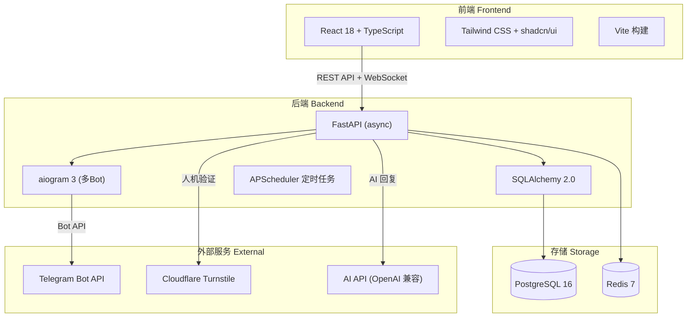
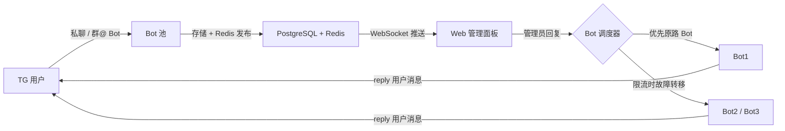

[English](./README_EN.md) | 中文

---


# ADMINCHAT Panel

> &reg; 2026 NovaHelix & SAKAKIBARA. All rights reserved.

**Telegram 双向消息转发 Bot + Web 客服管理面板** &mdash; 一站式 Telegram 客户服务解决方案，支持多 Bot 池管理、FAQ 自动回复、AI 集成和实时 Web 聊天。

---

## 项目简介

ADMINCHAT Panel 是一个功能完备的 Telegram 客服管理系统。它将 Telegram Bot 收到的私聊消息和群组 @提及 消息统一转发到 Web 管理面板，让管理员/客服人员可以在浏览器中实时查看并回复用户消息，同时支持 FAQ 自动回复、AI 智能应答、用户管理等丰富功能。

## 核心功能

- **多 Bot 池管理** &mdash; 支持无限添加 Bot，自动限流检测与故障转移
- **双向消息转发** &mdash; 私聊 + 群组 @Bot，文本/图片/视频/文件/Markdown 格式完整保留
- **Web 实时聊天** &mdash; 基于 WebSocket 的实时消息推送，类似客服系统的聊天界面
- **FAQ 自动回复引擎** &mdash; 8 种回复模式（正则匹配/AI 直答/AI 润色/AI 兜底/意图识别/模板填充/RAG 预留/综合回答）
- **用户管理** &mdash; 标签/分组/拉黑/搜索，完整的 TG 用户信息展示
- **AI 集成** &mdash; 兼容 OpenAI API 格式，支持多 AI 服务商配置
- **Cloudflare Turnstile** &mdash; 私聊用户人机验证，防止滥用
- **角色权限系统** &mdash; Super Admin / Admin / Agent 三级权限，细粒度权限控制
- **操作审计日志** &mdash; 关键操作自动记录，可追溯
- **遗漏知识点分析** &mdash; 自动统计未匹配问题，每日凌晨 3 点更新排行榜
- **Docker 一键部署** &mdash; docker compose up 即可运行，支持 GHCR 镜像发布

## 技术架构



## 消息路由流程



## 数据库结构

| 表名 | 说明 | 核心字段 |
|------|------|---------|
| `admins` | 管理员/客服 | username, role, permissions (JSONB) |
| `tg_users` | Telegram 用户 | tg_uid, is_blocked, turnstile_verified_at |
| `bots` | Bot 池 | token, priority, is_rate_limited |
| `conversations` | 会话 | status, source_type, assigned_to |
| `messages` | 消息记录 | direction, content_type, faq_matched |
| `tg_groups` | Telegram 群组 | tg_chat_id, title |
| `tags` / `user_tags` | 用户标签 | name, color (多对多) |
| `user_groups` | 用户分组 | name, description |
| `faq_questions` | FAQ 问题/关键词 | keyword, match_mode |
| `faq_answers` | FAQ 答案 | content, content_type |
| `faq_rules` | FAQ 规则 | response_mode, reply_mode, ai_config |
| `faq_hit_stats` | FAQ 命中统计 | hit_count, date |
| `missed_keywords` | 遗漏知识点 | keyword, occurrence_count |
| `ai_configs` | AI 配置 | base_url, api_key, model |
| `ai_usage_logs` | AI 用量日志 | tokens_used, cost_estimate |
| `system_settings` | 系统设置 | key-value (JSONB) |
| `audit_logs` | 审计日志 | action, target_type, details |

> 共 23 张表，完整设计参见 [docs/DATABASE_DESIGN.md](docs/DATABASE_DESIGN.md)

## FAQ 回复模式

| 模式 | 代码标识 | 说明 |
|------|---------|------|
| 纯正则匹配 | `direct` | 关键词匹配后直接返回预设答案 |
| 纯 AI 回复 | `ai_only` | 用户问题直接交给 AI（有次数限制） |
| AI 润色 | `ai_polish` | 匹配预设答案后让 AI 改写更自然 |
| AI 兜底 | `ai_fallback` | 先走 FAQ，未命中再交 AI |
| AI 意图识别 | `ai_intent` | AI 分析意图后路由到对应 FAQ 分类 |
| 模板填充 | `ai_template` | 预设模板 + AI 动态填充变量 |
| RAG 知识库 | `rag` | 预留，向量检索 + AI 回答 |
| AI 综合回答 | `ai_classify_and_answer` | AI 参考 FAQ 知识库综合生成回答 |

## 快速开始

```bash
# 克隆仓库
git clone https://github.com/fxxkrlab/ADMINCHAT_PANEL.git
cd ADMINCHAT_PANEL/deploy

# 配置环境变量
cp .env.example .env
nano .env  # 修改密码、Bot Token、域名等

# 一键启动 (包含 PostgreSQL + Redis + Nginx)
docker compose -f docker-compose.full.yml up -d

# 访问 http://服务器IP
# 默认账号: admin / 密码见 .env 中的 INIT_ADMIN_PASSWORD
```

## 安装方式

详细部署文档见 [`deploy/README.md`](deploy/README.md)

| 方式 | 文件 | 适用场景 |
|------|------|---------|
| Docker Run | [`deploy/docker-run.sh`](deploy/docker-run.sh) | 已有 PG+Redis，只部署应用 |
| Compose 独立版 | [`deploy/docker-compose.standalone.yml`](deploy/docker-compose.standalone.yml) | 已有 PG+Redis，Compose 管理 |
| Compose 一键版 | [`deploy/docker-compose.full.yml`](deploy/docker-compose.full.yml) | 全新服务器，一键全部 |

每种方式都支持 **Named Volume**（Docker 管理）和 **Bind Mount**（映射宿主机目录），在 yml 文件注释中切换。

## 项目结构

```
ADMINCHAT_PANEL/
├── backend/                    # Python 后端
│   ├── app/
│   │   ├── api/v1/            # REST API 路由 (15 个模块)
│   │   ├── bot/               # Telegram Bot 核心
│   │   │   ├── manager.py     # 多 Bot 生命周期管理
│   │   │   ├── handlers/      # 消息处理器 (私聊/群组/指令)
│   │   │   ├── dispatcher.py  # 消息发送 + 故障转移
│   │   │   └── rate_limiter.py# 限流检测 (Redis 令牌桶)
│   │   ├── faq/               # FAQ 引擎
│   │   │   ├── engine.py      # 匹配引擎
│   │   │   ├── ai_handler.py  # AI 回复处理 (8 种模式)
│   │   │   └── rag_handler.py # RAG 预留接口
│   │   ├── models/            # SQLAlchemy ORM (23 张表)
│   │   ├── schemas/           # Pydantic 请求/响应模型
│   │   ├── services/          # 业务服务 (Redis/审计/媒体/Turnstile)
│   │   ├── ws/                # WebSocket 实时通信
│   │   └── tasks/             # 定时任务 (APScheduler)
│   ├── alembic/               # 数据库迁移
│   └── Dockerfile
├── frontend/                   # React 前端
│   ├── src/
│   │   ├── pages/             # 14 个页面
│   │   ├── components/        # 可复用组件 (chat/layout/ui)
│   │   ├── stores/            # Zustand 状态管理
│   │   ├── services/          # API 调用层 (9 个模块)
│   │   ├── hooks/             # 自定义 hooks (WebSocket/debounce)
│   │   └── types/             # TypeScript 类型定义
│   └── Dockerfile
├── docker/                     # Docker 配置
├── docs/                       # 设计文档
│   ├── ORIGINAL_REQUIREMENTS.md
│   ├── ARCHITECTURE.md
│   ├── DATABASE_DESIGN.md
│   ├── API_DESIGN.md
│   ├── BOT_DESIGN.md
│   ├── FAQ_ENGINE.md
│   ├── FRONTEND_PAGES.md
│   └── DEPLOYMENT.md
├── docker-compose.yml
├── .env.example
└── LICENSE                     # GPL-3.0
```

## 开发指南

### 后端开发

```bash
cd backend
python -m venv .venv
source .venv/bin/activate
pip install -r requirements.txt

# 需要 PostgreSQL 和 Redis 运行中
# 可以用 docker compose up postgres redis -d 启动

# 运行数据库迁移
alembic upgrade head

# 启动开发服务器
uvicorn app.main:app --reload --port 8000
```

### 前端开发

```bash
cd frontend
npm install
npm run dev
# 访问 http://localhost:5173
```

## 许可证

本项目采用 [GNU General Public License v3.0](LICENSE) 开源。

**版权所有 &copy; 2026 NovaHelix & SAKAKIBARA**

你可以自由使用、修改和分发本软件，但必须：
- 保持开源（不可闭源商用，版权所有者除外）
- 保留原始版权声明
- 使用相同的 GPL-3.0 许可证

---

<p align="center">
  Powered By ADMINCHAT PANEL v0.1.0 (20260321.0001)<br/>
  <small>&reg; 2026 NovaHelix & SAKAKIBARA</small>
</p>
