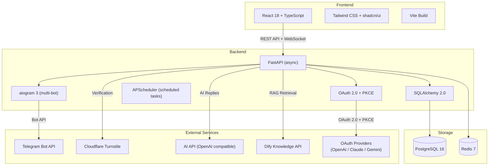
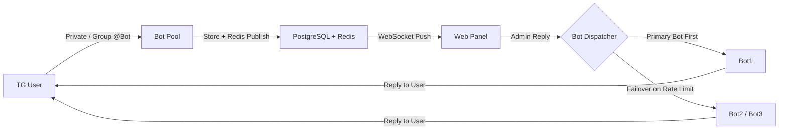
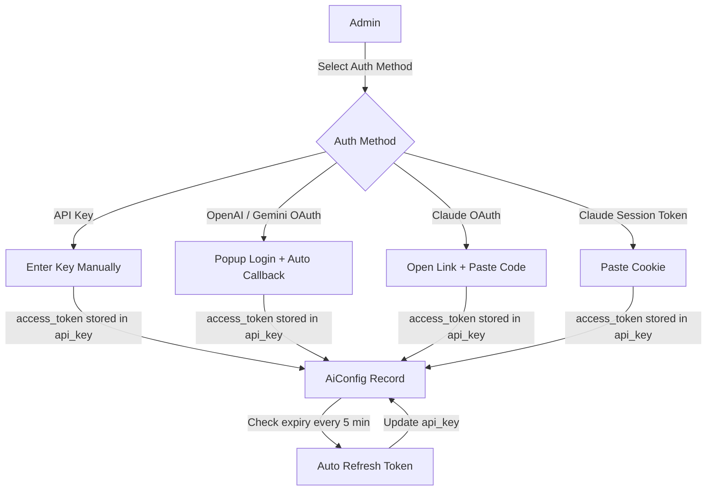

English | [中文](./README.md)

---

<!-- Community & Status -->


<!-- Tech Stack -->


<!-- Fun / Vibe -->


# ADMINCHAT Panel

> &reg; 2026 NovaHelix & SAKAKIBARA. All rights reserved.

**Telegram Bidirectional Message Forwarding Bot + Web Customer Service Panel** &mdash; A complete Telegram customer service solution featuring multi-bot pool management, FAQ auto-reply with 5 match modes and 8 reply modes, RAG knowledge base retrieval, AI provider OAuth multi-auth, and a real-time WebSocket chat interface.

---

## Overview

ADMINCHAT Panel is a production-ready Telegram customer service management system. It collects private messages and group @mentions received by your Telegram bots and forwards them into a unified web panel where admins and agents can view and respond in real time. Beyond live chat, the platform provides a sophisticated FAQ engine with regex matching, AI-powered responses, RAG knowledge base retrieval, missed keyword analysis, configurable keyword filters, and full user lifecycle management.

## Key Features

- **Multi-Bot Pool** &mdash; Add unlimited bots with automatic rate-limit detection and failover between pool members
- **Bidirectional Message Forwarding** &mdash; Private chat and group @mentions, preserving text, images, videos, files, and Markdown formatting
- **Real-time Web Chat** &mdash; WebSocket-powered live messaging with a customer-service-style interface
- **FAQ Auto-Reply Engine** &mdash; 5 match modes (exact, prefix, contains, regex, catch_all) combined with 8 reply modes for flexible response handling
- **RAG Knowledge Base** &mdash; Modular RAG architecture with Dify Knowledge API integration (GTE-multilingual + pgvector), extensible to other providers
- **AI Provider OAuth Multi-Auth** &mdash; 5 authentication methods: API Key / OpenAI OAuth / Claude OAuth / Claude Session Token / Gemini OAuth, with automatic token refresh
- **Missed Keyword Filters** &mdash; Configurable filter rules with 4 match modes (exact, prefix, contains, regex) to auto-bypass irrelevant keywords such as bot commands (`/start`, `/about`)
- **User Management** &mdash; Tags, groups, blocking, search, and full Telegram user profile display
- **AI Integration** &mdash; OpenAI-compatible API format with multi-provider configuration
- **Cloudflare Turnstile** &mdash; Human verification for private chat users to prevent abuse
- **Bot Groups + FAQ Group Routing** &mdash; Organize bots and FAQ rules into a Group &rarr; Category hierarchy; matched rules automatically route replies through the assigned bot group
- **Role-Based Access Control** &mdash; Super Admin / Admin / Agent with granular permission sets
- **Audit Logging** &mdash; Automatic tracking of all critical operations
- **Missed Knowledge Analysis** &mdash; Detects unmatched questions and builds daily frequency rankings (updated at 3 AM)
- **Global Error Boundary** &mdash; Frontend error isolation preventing full-page crashes
- **Docker One-Click Deployment** &mdash; `docker compose up` to run, with pre-built images published to GHCR

<details>
<summary><strong>RAG Knowledge Base Setup Guide (click to expand)</strong></summary>

#### Complete RAG Customer Service Flow

```
User sends message on Telegram
  → ADMINCHAT Bot receives message
  → FAQ Engine matches rule (reply_mode=rag)
  → Calls Dify Knowledge API (sends user question)
  → Dify uses GTE-multilingual-base to vectorize the question
  → pgvector performs vector search, finds most relevant knowledge
  → Returns search results to ADMINCHAT
  → ADMINCHAT calls AI API (search results + user question)
  → AI generates natural language answer based on knowledge base
  → Bot replies to user
```

Component responsibilities:

| Component | Role |
|-----------|------|
| **Dify** | Knowledge base management + vector search (retrieval only) |
| **GTE-multilingual-base** | Embedding model (text → vectors, runs on CPU) |
| **pgvector** (PostgreSQL extension) | Store and retrieve vectors |
| **AI API** (external, e.g. GPT/Claude) | Generate final answer (based on retrieved context) |
| **ADMINCHAT Panel** | Orchestrates all components + Telegram Bot management |

#### Step 1: Deploy Dify

We recommend Dify's official Docker Compose deployment. Dify includes pgvector and a knowledge base management UI out of the box.

```bash
# Clone Dify
git clone https://github.com/langgenius/dify.git
cd dify/docker

# Copy environment variables
cp .env.example .env

# Start (includes PostgreSQL + pgvector + Redis + Dify API + Web)
docker compose up -d
```

After startup, visit `http://your-server-ip` to complete Dify initialization.

#### Step 2: Install Text Embedding Inference (TEI) Plugin

Dify doesn't include a local embedding model by default. You need the Hugging Face TEI plugin to use GTE-multilingual-base.

**Option A: Install via Dify Plugin Marketplace (Recommended)**

1. Log in to Dify admin dashboard
2. Go to **Plugins** page
3. Search for `Text Embedding Inference`
4. Click Install

**Option B: Deploy TEI Container Manually**

```bash
# Deploy TEI container (CPU mode, suitable for most scenarios)
docker run -d \
  --name text-embeddings-inference \
  --restart unless-stopped \
  -p 8090:80 \
  -v tei-data:/data \
  ghcr.io/huggingface/text-embeddings-inference:cpu-1.5 \
  --model-id Alibaba-NLP/gte-multilingual-base \
  --port 80

# Verify it's running
curl http://localhost:8090/embed \
  -X POST \
  -H 'Content-Type: application/json' \
  -d '{"inputs": "test text"}'
```

> **Note**: `gte-multilingual-base` is ~1.1GB. First startup will download the model and may take a few minutes.

#### Step 3: Configure Embedding Model in Dify

1. Go to Dify → **Settings** → **Model Providers**
2. Find **Text Embedding Inference** or **Hugging Face**
3. Configure:
   - **Model Name**: `gte-multilingual-base` (display name only)
   - **Server URL**: `http://text-embeddings-inference:80` (Docker internal) or `http://your-server-ip:8090` (external)
4. Save and test the connection

#### Step 4: Create Knowledge Base and Import Documents

1. Go to Dify → **Knowledge** → **Create Knowledge Base**
2. Select the embedding model you just configured (`gte-multilingual-base`)
3. Upload documents (supports TXT, PDF, Markdown, CSV, etc.)
4. Dify will automatically segment, vectorize, and store in pgvector
5. After creation, note down:
   - **Dataset ID**: The UUID in the knowledge base URL (e.g. `abc123-def456` from `datasets/abc123-def456/...`)

#### Step 5: Get Dify API Credentials

1. Go to Dify → **Knowledge** → select your knowledge base
2. Go to **API Access** or **Settings**
3. Get the **Dataset API Key** (format: `dataset-xxxxxxxx`)
4. Note the Dify API address (usually `http://your-server-ip/v1` or Docker internal `http://docker-api-1:5001/v1`)

#### Step 6: Configure RAG in ADMINCHAT Panel

1. Log in to the ADMINCHAT admin panel
2. Go to **AI Settings** → **RAG Knowledge Base** tab
3. Click **Add RAG Config** and fill in:
   - **Name**: Custom name (e.g. "Product Knowledge Base")
   - **Provider**: `dify`
   - **Base URL**: Dify API address (e.g. `http://docker-api-1:5001/v1`)
   - **API Key**: The Dataset API Key from above
   - **Dataset ID**: The knowledge base UUID from above
   - **Top K**: `3` (return top 3 most relevant results)
4. Click **Test** to verify the connection
5. Save

#### Step 7: Configure FAQ Rules to Use RAG

1. Go to **FAQ Rules** → create or edit a rule
2. Set **Reply Mode** to `rag`
3. Select the RAG Config you just created
4. Recommended: pair with `catch_all` match mode as a low-priority fallback rule, so all unmatched messages go through RAG

#### Recommended Deployment Architecture

```
┌─────────────────────────────────────────────────┐
│  Docker Host                                     │
│                                                   │
│  ┌─────────────┐  ┌──────────────────────────┐   │
│  │ ADMINCHAT   │  │ Dify (docker compose)     │   │
│  │ Backend     │──│  ├─ dify-api              │   │
│  │ Frontend    │  │  ├─ dify-web              │   │
│  └─────────────┘  │  ├─ postgres (pgvector)   │   │
│                    │  ├─ redis                 │   │
│  ┌─────────────┐  │  └─ ...                   │   │
│  │ TEI Server  │──│                            │   │
│  │ (gte-multi) │  └──────────────────────────┘   │
│  └─────────────┘                                  │
│                    ┌──────────────────────────┐   │
│                    │ AI API (external)         │   │
│                    │ GPT / Claude / Gemini     │   │
│                    └──────────────────────────┘   │
└─────────────────────────────────────────────────┘
```

> **Tip**: If ADMINCHAT and Dify are on the same server, use Docker internal networking (e.g. `http://docker-api-1:5001/v1`) to avoid external traffic. This is faster and more secure. Make sure both are on the same Docker network.

</details>

## Screenshots

<p align="center">
  
  
</p>
<p align="center">
  
  
</p>
<p align="center">
  
  
</p>
<p align="center">
  
</p>

## Architecture



## Message Routing Flow



## AI Provider OAuth Flow



## Database Schema

| Table | Description | Key Fields |
|-------|-------------|------------|
| `admins` | Panel admins and agents | username, role, permissions (JSONB) |
| `tg_users` | Telegram users | tg_uid, is_blocked, turnstile_verified_at |
| `bots` | Bot pool | token, priority, is_rate_limited |
| `conversations` | Chat sessions | status, source_type, assigned_to |
| `messages` | Message records | direction, content_type, faq_matched |
| `tg_groups` | Telegram groups | tg_chat_id, title |
| `group_bots` | Group-bot associations | tg_group_id, bot_id |
| `tags` / `user_tags` | User tags | name, color (many-to-many) |
| `user_groups` / `user_group_members` | User groups | name, description (many-to-many) |
| `faq_rules` | FAQ rules | response_mode, reply_mode, category_id |
| `faq_questions` / `faq_answers` | FAQ Q&A pairs | keyword, match_mode / content, content_type |
| `faq_rule_questions` / `faq_rule_answers` | FAQ rule M2M links | faq_rule_id, question_id / answer_id |
| `faq_groups` | FAQ groups (level 1) | name, bot_group_id |
| `faq_categories` | FAQ categories (level 2) | name, faq_group_id, bot_group_id |
| `faq_hit_stats` | FAQ hit statistics | hit_count, date |
| `missed_keywords` | Unmatched keyword rankings | keyword, occurrence_count |
| `missed_keyword_filters` | Keyword filter rules | pattern, match_mode (exact/prefix/contains/regex) |
| `unmatched_messages` | Raw unmatched messages | text_content, tg_user_id |
| `bot_groups` / `bot_group_members` | Bot groups | name / bot_group_id, bot_id |
| `ai_configs` | AI provider configurations | base_url, api_key, model, auth_method, oauth_data |
| `ai_usage_logs` | AI usage tracking | tokens_used, cost_estimate |
| `rag_configs` | RAG knowledge base configs | provider, base_url, api_key, dataset_id, top_k, is_active |
| `system_settings` | System settings | key-value (JSONB) |
| `audit_logs` | Audit trail | action, target_type, details |

> 30 tables total. See [docs/DATABASE_DESIGN.md](docs/DATABASE_DESIGN.md) for the full schema.

## FAQ Match Modes

| Mode | Code | Description |
|------|------|-------------|
| Exact | `exact` | Full text must equal the keyword (case-insensitive) |
| Prefix | `prefix` | Text must start with the keyword |
| Contains | `contains` | Keyword appears anywhere in the text |
| Regex | `regex` | Text matches a regular expression pattern |
| Catch All | `catch_all` | Matches any incoming message; designed as a low-priority fallback for RAG rules |

## FAQ Reply Modes

| Mode | Code | Description |
|------|------|-------------|
| Direct Match | `direct` | Return the preset answer on keyword match |
| AI Only | `ai_only` | Forward the question directly to AI (rate limited) |
| AI Polish | `ai_polish` | Match a preset answer, then let AI rewrite it for a natural tone |
| AI Fallback | `ai_fallback` | Try FAQ first; hand off to AI only when no rule matches |
| AI Intent | `ai_intent` | AI classifies the user's intent, then routes to the matching FAQ category |
| Template Fill | `ai_template` | Preset template with AI-filled dynamic variables |
| RAG | `rag` | Vector retrieval (Dify / pgvector) combined with an AI-synthesized answer |
| AI Comprehensive | `ai_classify_and_answer` | AI generates an answer referencing the full FAQ knowledge base |

## Missed Keyword Filters

The missed knowledge analysis system automatically collects unmatched user messages and ranks them by frequency. To keep the rankings useful, you can configure **keyword filters** that automatically bypass irrelevant messages such as bot commands (`/start`, `/help`, `/about`) or common greetings.

Each filter supports 4 match modes:

| Mode | Behavior |
|------|----------|
| `exact` | Message must exactly equal the pattern |
| `prefix` | Message must start with the pattern |
| `contains` | Pattern appears anywhere in the message |
| `regex` | Message matches the regular expression |

## AI Provider Auth Methods

| Method | Flow | Description |
|--------|------|-------------|
| API Key | Manual input | Traditional method: enter Base URL + API Key directly |
| OpenAI OAuth | Popup login | OAuth 2.0 + PKCE, browser popup with auto-callback |
| Claude OAuth | Code paste | OAuth 2.0 + PKCE, Claude displays a code on its fixed callback page; the user copies and pastes it |
| Claude Session Token | Cookie paste | Copy the `sessionKey` cookie from claude.ai; the backend exchanges it for access tokens |
| Gemini OAuth | Popup login | Google OAuth 2.0 + PKCE, browser popup with auto-callback |

> **Automatic token refresh:** A background job checks every 5 minutes for tokens approaching expiry and renews them automatically. The refresh also runs at server startup to compensate for any downtime.

## Quick Start

```bash
# Clone the repository
git clone https://github.com/fxxkrlab/ADMINCHAT_PANEL.git
cd ADMINCHAT_PANEL/deploy

# Configure environment variables
cp .env.example .env
nano .env  # Set passwords, bot tokens, domain, etc.

# One-click start (includes PostgreSQL + Redis + Nginx)
docker compose -f docker-compose.full.yml up -d

# Visit http://your-server-ip
# Default login: admin / (see INIT_ADMIN_PASSWORD in .env)
```

## Installation Methods

For detailed deployment instructions, see [`deploy/README.md`](deploy/README.md).

| Method | File | Use Case |
|--------|------|----------|
| Docker Run | [`deploy/docker-run.sh`](deploy/docker-run.sh) | Existing PG + Redis, deploy the app only |
| Compose Standalone | [`deploy/docker-compose.standalone.yml`](deploy/docker-compose.standalone.yml) | Existing PG + Redis, Compose-managed |
| Compose Full Stack | [`deploy/docker-compose.full.yml`](deploy/docker-compose.full.yml) | Fresh server, deploy everything at once |

Each method supports both **Named Volumes** (Docker-managed) and **Bind Mounts** (host directory mapping). Switch between them by toggling the comments in the respective yml file.

## Project Structure

```
ADMINCHAT_PANEL/
├── backend/                    # Python backend
│   ├── app/
│   │   ├── api/v1/            # REST API routes (17 modules)
│   │   ├── bot/               # Telegram Bot core
│   │   │   ├── manager.py     # Multi-bot lifecycle management
│   │   │   ├── handlers/      # Message handlers (private/group/commands)
│   │   │   ├── dispatcher.py  # Message dispatch + failover
│   │   │   └── rate_limiter.py# Rate-limit detection (Redis token bucket)
│   │   ├── faq/               # FAQ engine
│   │   │   ├── engine.py      # Match engine
│   │   │   ├── matcher.py     # 5 match mode functions
│   │   │   ├── ai_handler.py  # AI reply handler (8 modes)
│   │   │   ├── rag_handler.py # RAG compatibility wrapper
│   │   │   └── rag/           # Modular RAG system
│   │   │       ├── base.py    # RAGProvider abstract base class
│   │   │       └── dify_provider.py  # Dify Knowledge API provider
│   │   ├── oauth/             # OAuth 2.0 multi-auth
│   │   │   ├── base.py        # OAuthProvider abstract base class
│   │   │   ├── encryption.py  # Fernet token encryption
│   │   │   ├── openai.py      # OpenAI OAuth + PKCE
│   │   │   ├── claude.py      # Claude OAuth + Session Token
│   │   │   ├── gemini.py      # Gemini/Google OAuth + PKCE
│   │   │   └── token_refresh.py # Automatic token refresh task
│   │   ├── models/            # SQLAlchemy ORM (30 tables)
│   │   ├── schemas/           # Pydantic request/response models
│   │   ├── services/          # Business services (Redis/audit/media/Turnstile)
│   │   ├── ws/                # WebSocket real-time communication
│   │   └── tasks/             # Scheduled tasks (APScheduler)
│   ├── alembic/               # Database migrations
│   └── Dockerfile
├── frontend/                   # React frontend
│   ├── src/
│   │   ├── pages/             # 14+ pages
│   │   ├── components/        # Reusable components (chat/layout/ui/ai)
│   │   │   └── ai/           # OAuth authentication components
│   │   │       ├── AuthMethodSelector.tsx  # Auth method selector
│   │   │       └── OAuthFlowModal.tsx      # OAuth flow modal
│   │   ├── stores/            # Zustand state management
│   │   ├── services/          # API service layer (11 modules)
│   │   ├── hooks/             # Custom hooks (WebSocket, debounce)
│   │   └── types/             # TypeScript type definitions
│   └── Dockerfile
├── deploy/                     # Deployment configurations
├── docs/                       # Design documents
├── docker-compose.yml          # Local dev (PG + Redis only)
├── .env.example
└── LICENSE                     # GPL-3.0
```

## Development

### Backend

```bash
cd backend
python -m venv .venv && source .venv/bin/activate
pip install -r requirements.txt

# Start PostgreSQL and Redis (if not already running)
docker compose up postgres redis -d

# Run database migrations
alembic upgrade head

# Start the development server
uvicorn app.main:app --reload --port 8000
```

### Frontend

```bash
cd frontend
npm install
npm run dev
# Visit http://localhost:5173
```

## What's New in v0.8.1

- **AI Usage Tracking & Cost Estimation** &mdash; Every AI call now logs prompt/completion tokens, model name, and reply mode to `ai_usage_logs`. Built-in pricing table for 25+ models (GPT-4o, Claude, Gemini, DeepSeek, etc.) with fuzzy model name matching for automatic cost estimation
- **Enhanced Usage Statistics** &mdash; 4-card summary layout (requests, tokens with input/output split, estimated cost, avg tokens/request), model column and token breakdown in per-provider table
- **Chat Message Stacking Fix** &mdash; Fixed 5-second auto-refresh causing message list duplication and page jumping

## What's New in v0.8.0

- **Missed Keyword Filters** &mdash; Configurable filter system with 4 match modes (exact, prefix, contains, regex) to automatically bypass irrelevant keywords like bot commands (`/start`, `/about`) from the missed knowledge rankings
- **Catch All Match Mode** &mdash; New FAQ question `match_mode` that matches any incoming message, designed as a low-priority fallback for RAG-based rules
- **N+1 Query Optimizations** &mdash; Eager loading applied across critical API endpoints to eliminate redundant database queries
- **Schema Validation Fixes** &mdash; Corrected Pydantic schema definitions and added missing foreign key constraints and indexes
- **Global Error Boundary** &mdash; Frontend error isolation component preventing unhandled exceptions from crashing the entire application
- **Improved Error Logging** &mdash; Structured error output across backend services for easier debugging

## License

This project is licensed under the [GNU General Public License v3.0](LICENSE).

**Copyright &copy; 2026 NovaHelix & SAKAKIBARA**

You are free to use, modify, and distribute this software, provided that you:
- Keep derivative works open source (closed-source commercial use is permitted only by the copyright holders)
- Retain the original copyright notice
- License derivative works under the same GPL-3.0 terms

---

<p align="center">
  <small>&reg; 2026 NovaHelix & SAKAKIBARA</small>
</p>
