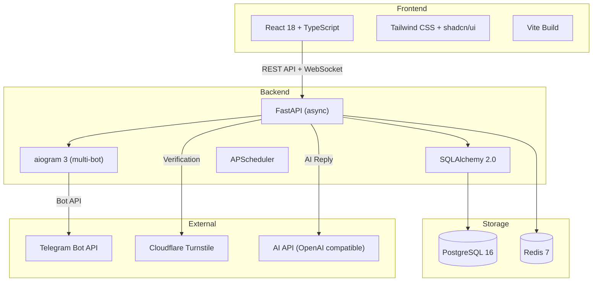
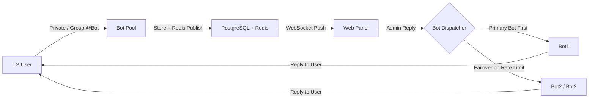

English | [中文](./README.md)

---


# ADMINCHAT Panel

> &reg; 2026 NovaHelix & SAKAKIBARA. All rights reserved.

**Telegram Bidirectional Message Forwarding Bot + Web Customer Service Management Panel** &mdash; An all-in-one Telegram customer service solution with multi-bot pool management, FAQ auto-reply, AI integration, and real-time web chat.

---

## Overview

ADMINCHAT Panel is a full-featured Telegram customer service management system. It forwards private messages and group @mentions from Telegram bots to a web management panel, enabling admins and agents to view and reply to user messages in real-time through the browser. It also supports FAQ auto-reply, AI-powered responses, user management, and more.

## Key Features

- **Multi-Bot Pool** &mdash; Unlimited bot instances with automatic rate-limit detection and failover
- **Bidirectional Forwarding** &mdash; Private chat + Group @Bot, preserving text/images/videos/files/Markdown
- **Real-time Web Chat** &mdash; WebSocket-based live messaging, customer service style interface
- **FAQ Auto-Reply Engine** &mdash; 8 reply modes (regex match / AI direct / AI polish / AI fallback / intent recognition / template fill / RAG ready / comprehensive AI)
- **User Management** &mdash; Tags, groups, blocking, search, full Telegram user info display
- **AI Integration** &mdash; OpenAI-compatible API format, multi-provider support
- **Cloudflare Turnstile** &mdash; Human verification for private chat users
- **Role-Based Access** &mdash; Super Admin / Admin / Agent with granular permissions
- **Audit Logging** &mdash; Automatic tracking of critical operations
- **Knowledge Gap Analysis** &mdash; Auto-detect unmatched questions, daily ranking updates at 3 AM
- **Docker Deployment** &mdash; Single `docker compose up` to run, GHCR image publishing

## Architecture



## Message Routing Flow



## Database Schema

| Table | Description | Key Fields |
|-------|-------------|------------|
| `admins` | Panel admins/agents | username, role, permissions (JSONB) |
| `tg_users` | Telegram users | tg_uid, is_blocked, turnstile_verified_at |
| `bots` | Bot pool | token, priority, is_rate_limited |
| `conversations` | Chat sessions | status, source_type, assigned_to |
| `messages` | Message records | direction, content_type, faq_matched |
| `tg_groups` | Telegram groups | tg_chat_id, title |
| `tags` / `user_tags` | User tags | name, color (many-to-many) |
| `faq_rules` | FAQ rules | response_mode, reply_mode, ai_config |
| `faq_hit_stats` | FAQ hit stats | hit_count, date |
| `missed_keywords` | Knowledge gaps | keyword, occurrence_count |
| `ai_configs` | AI provider configs | base_url, api_key, model |
| `audit_logs` | Audit trail | action, target_type, details |

> 23 tables total. See [docs/DATABASE_DESIGN.md](docs/DATABASE_DESIGN.md) for full schema.

## FAQ Reply Modes

| Mode | Code | Description |
|------|------|-------------|
| Direct Match | `direct` | Return preset answer on keyword match |
| AI Only | `ai_only` | Send question directly to AI (rate limited) |
| AI Polish | `ai_polish` | Match answer + AI rewrite for natural tone |
| AI Fallback | `ai_fallback` | Try FAQ first, AI if no match |
| AI Intent | `ai_intent` | AI classifies intent, routes to FAQ category |
| Template Fill | `ai_template` | Preset template + AI fills dynamic variables |
| RAG | `rag` | Reserved for vector retrieval + AI answer |
| AI Comprehensive | `ai_classify_and_answer` | AI generates answer using FAQ knowledge base |

## Quick Start

```bash
# Clone the repository
git clone https://github.com/fxxkrlab/ADMINCHAT_PANEL.git
cd ADMINCHAT_PANEL/deploy

# Configure environment
cp .env.example .env
nano .env  # Set passwords, bot tokens, domain, etc.

# One-click start (includes PostgreSQL + Redis + Nginx)
docker compose -f docker-compose.full.yml up -d

# Visit http://server-ip
# Default login: admin / (see INIT_ADMIN_PASSWORD in .env)
```

## Installation Methods

See full deployment docs at [`deploy/README.md`](deploy/README.md)

| Method | File | Use Case |
|--------|------|----------|
| Docker Run | [`deploy/docker-run.sh`](deploy/docker-run.sh) | Have PG+Redis, deploy app only |
| Compose Standalone | [`deploy/docker-compose.standalone.yml`](deploy/docker-compose.standalone.yml) | Have PG+Redis, Compose managed |
| Compose Full Stack | [`deploy/docker-compose.full.yml`](deploy/docker-compose.full.yml) | Fresh server, deploy everything |

Each method supports both **Named Volumes** (Docker-managed) and **Bind Mounts** (host directory mapping), switchable via comments in yml files.

## Project Structure

```
ADMINCHAT_PANEL/
├── backend/                    # Python backend (71 files)
│   ├── app/
│   │   ├── api/v1/            # REST API routes (15 modules)
│   │   ├── bot/               # Telegram Bot core
│   │   ├── faq/               # FAQ engine + AI handler
│   │   ├── models/            # SQLAlchemy ORM (23 tables)
│   │   ├── schemas/           # Pydantic models
│   │   ├── services/          # Business services
│   │   ├── ws/                # WebSocket real-time
│   │   └── tasks/             # Scheduled tasks
│   └── Dockerfile
├── frontend/                   # React frontend (35 files)
│   ├── src/
│   │   ├── pages/             # 14+ pages
│   │   ├── components/        # Reusable components
│   │   ├── stores/            # Zustand state management
│   │   ├── services/          # API service layer (9 modules)
│   │   └── hooks/             # Custom hooks
│   └── Dockerfile
├── docker-compose.yml
├── .env.example
└── LICENSE                     # GPL-3.0
```

## Development

### Backend

```bash
cd backend
python -m venv .venv && source .venv/bin/activate
pip install -r requirements.txt
# Start PostgreSQL + Redis: docker compose up postgres redis -d
alembic upgrade head
uvicorn app.main:app --reload --port 8000
```

### Frontend

```bash
cd frontend
npm install
npm run dev
# Visit http://localhost:5173
```

## License

This project is licensed under the [GNU General Public License v3.0](LICENSE).

**Copyright &copy; 2026 NovaHelix & SAKAKIBARA**

You are free to use, modify, and distribute this software, provided you:
- Keep it open source (no closed-source commercial use, except by copyright holders)
- Retain the original copyright notice
- Use the same GPL-3.0 license

---

<p align="center">
  Powered By ADMINCHAT PANEL v0.1.0 (20260321.0001)<br/>
  <small>&reg; 2026 NovaHelix & SAKAKIBARA</small>
</p>
